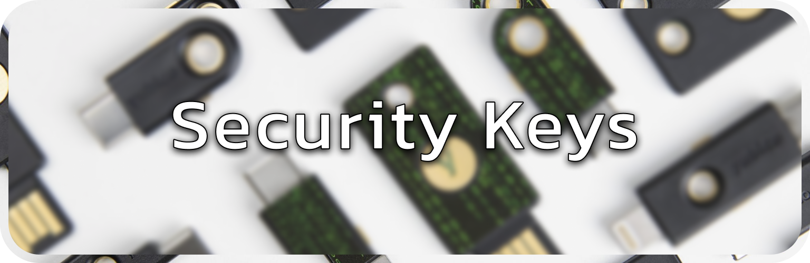

### Recommendations

| Provider | Links | Note |
| --- | :-- | :-- |
| :star:&nbsp;[YubiKey](https://www.yubico.com/products/) | [Documentation](https://docs.yubico.com/) [Compare](https://yubico.com/store/compare) [Yubico&nbsp;Authenticator](https://yubico.com/products/yubico-authenticator) [Privacy Policy](https://www.yubico.com/support/terms-conditions/privacy-notice/) | :warning: **YubiKey firmware isn't updateable. To get newer features or address vulnerabilities, you'll need to buy a new key.**
| [OnlyKey](https://onlykey.io/collections/all) | [Source Code](https://github.com/trustcrypto) [Documentation](https://docs.onlykey.io/) [Privacy Policy](https://onlykey.io/policies/privacy-policy) | |
| [Nitrokey](https://www.nitrokey.com/products/nitrokeys) | [Source Code](https://github.com/Nitrokey) [Documentation](https://docs.nitrokey.com/) [Privacy Policy](https://www.nitrokey.com/data-privacy-policy) | |
