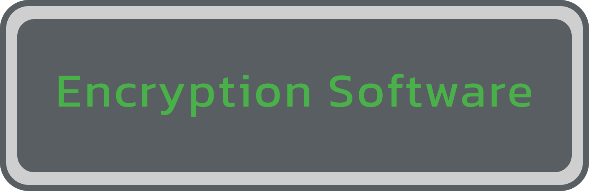

| Provider | Links |
| --- | :-- |
| :star: [Cryptomator](https://cryptomator.org/) | [Source Code](https://github.com/cryptomator) [Privacy Policy](https://cryptomator.org/privacy) [Documentation](https://docs.cryptomator.org/en/latest/)
| :star: [Picocrypt](https://github.com/Picocrypt/Picocrypt) | |
| :star: [Veracrypt](https://veracrypt.fr/) | [Source Code](https://veracrypt.fr/code) [Documentation](https://veracrypt.fr/en/Documentation.html) |
| [Hat.sh](https://hat.sh) | [Public Instances](https://github.com/sh-dv/hat.sh?tab=readme-ov-file#official-running-instances-of-the-app) [Source Code](https://github.com/sh-dv/hat.sh) [Privacy Policy](https://github.com/sh-dv/hat.sh?tab=readme-ov-file#privacy) [Self-Hosting](https://hat.sh/about/#installation) [Documentation](https://hat.sh/about/) |
| [GnuPG](https://gnupg.org/) | [Source Code](https://git.gnupg.org/cgi-bin/gitweb.cgi?p=gnupg-doc.git;a=summary) [Privacy Policy](https://gnupg.org/privacy-policy.html) [Documentation](https://gnupg.org/documentation/index.html) |
| [GPG4win](https://gpg4win.org/) | [Source Code](https://git.gnupg.org/cgi-bin/gitweb.cgi?p=gpg4win.git;a=summary) [Privacy Policy](https://gpg4win.org/privacy-policy.html) [Documentation](https://gpg4win.org/documentation.html) |
| [Kryptor](https://kryptor.co.uk/) | [Source Code](https://github.com/samuel-lucas6/Kryptor) [Privacy Policy](https://kryptor.co.uk/features#privacy) [Documentation](https://www.kryptor.co.uk/tutorial) |
| [Tomb](https://dyne.org/software/tomb) | [Source Code](https://github.com/dyne/Tomb) [Privacy Policy](https://dyne.org/tomb/cookies/) [Documentation](https://dyne.org/docs/tomb/) |
