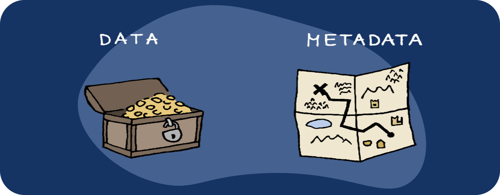

# Understanding Metadata

Metadata can be defined as "data about data." It consists of descriptive information that provides context, structure, and characteristics of other data. While the actual content or message of a communication or file is its "data," metadata offers insights into how, when, where, and by whom the data was created, modified, or accessed.

## Types of Metadata:

1. **Descriptive Metadata**: Includes information like titles, tags, and keywords that describe the content.
   
2. **Administrative Metadata**: Details about the creation, format, and management of the data.
   
3. **Structural Metadata**: Defines the relationships between different pieces of data, such as in databases or hierarchical file systems.
   
4. **Technical Metadata**: Specifications about the technical aspects of data, such as file type, resolution of images, or encoding of audio files.

## Why Metadata Matters:

Understanding metadata is crucial because:

- **Privacy Concerns**: Metadata can reveal sensitive information such as locations visited, communication patterns, or browsing history.
  
- **Security Implications**: Bad actors can use metadata for sneaky stuff. They can gather intel for targeted attacks or exploit vulnerabilities. Not cool!
  
- **Data Management**: Properly managing metadata can make your life easier. It helps with searching, retrieving, and organizing your precious data. No more digging through piles of files!

## Examples of Metadata:

- **Email Metadata**: When you send an email, it leaves a trail of metadata. It includes details like who sent it, who received it, and when it was sent.
  
- **Photo Metadata**: It includes things like camera settings, location coordinates (geotags), and even timestamps.
  
- **Web Metadata**: When you browse the web, you leave behind some digital footprints. This web metadata includes things like IP addresses, browser types, and those sneaky cookies that track your online activities.

## Removing Metadata from Files/Documents/Pictures:

Recommended software:

- ExifTool - https://exiftool.org/
- ExifCleaner - https://exifcleaner.com/
- pdfparanoia - https://github.com/kanzure/pdfparanoia
- mat2 - https://0xacab.org/jvoisin/mat2
- Scrambled Exif - https://gitlab.com/juanitobananas/scrambled-exif
- Metadata Remover - https://github.com/Anish-M-code/Metadata-Remover

***ExifTool** is natively available on **Tails** and **Whonix Workstation***

# As always

::: warning REMEMBER

- **Minimize Sharing**: Be cautious about sharing personal information online.
  
- **Use Privacy Settings**: Adjust privacy settings on devices and platforms to limit metadata exposure.
  
- **Encryption**: Encrypt sensitive communications to protect metadata from unauthorized access.
  
- **Metadata Removal Tools**: Use tools to strip metadata from files before sharing them online.
:::